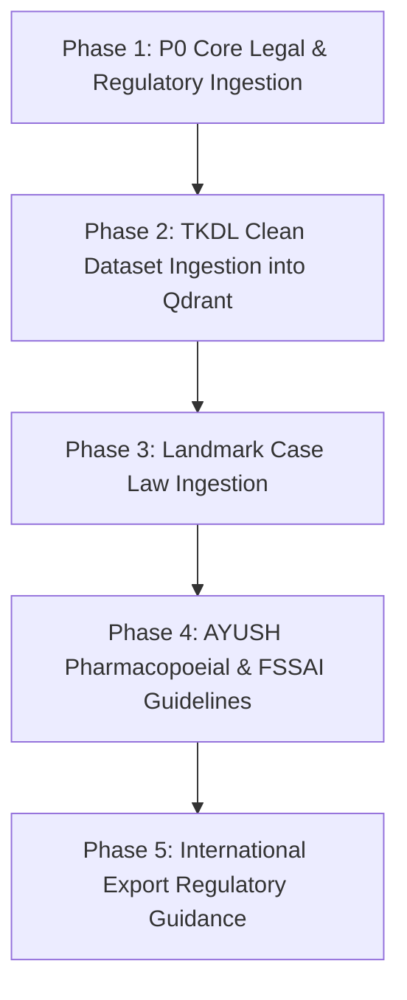

# IP-SAKTI Sahayak — Authoritative Indian Legal & Regulatory Dataset Roadmap

---

## 1. Executive Summary

**IP-SAKTI Sahayak** (SIH Problem Statement ID: 26045) is a specialized, source-cited, multilingual RAG platform designed to assist researchers, startups, AYUSH practitioners, IP attorneys, and statutory authorities in navigating Intellectual Property Rights (IPR), Biological Diversity Access & Benefit Sharing (ABS), and regulatory compliance across Traditional Knowledge (AYUSH — Ayurveda, Siddha, Unani, Sowa-Rigpa).

To achieve 100% statutory precision and eliminate hallucination, the RAG corpus must rely exclusively on **Authoritative Primary Sources** — official Gazette notifications, statutory Acts, statutory Rules, official manuals, public registries, and court precedent.

This roadmap details the exact datasets required across 14 distinct legal/regulatory domains, their official sources, public accessibility, extraction methods, priority classification (P0 to P3), metadata schema, and RAG ingestion strategy.

---

## 2. Current Datasets Inventory

| Dataset Name | Source | Format | Record Count | Location | RAG Active? | Qdrant Indexed? |
| :--- | :--- | :---: | ---: | :--- | :---: | :---: |
| **Legal & Regulatory PDF Corpus** | Official Govt Acts / WIPO | 31 PDFs | 31 Docs (5,573 chunks) | `data/legal_corpus/` | **YES** | **YES** (5,573 vectors) |
| **TKDL Representative Keywords** | CSIR-TKDL Public Portal | JSON / CSV | 3,012 raw / 1,722 clean | `data/tkdl_public/{sys}/` | NO | NO |
| **TKDL Bio-Piracy Case Studies** | CSIR-TKDL Public Portal | JSON / CSV | 12 Topic Studies | `data/tkdl_public/biopiracy/` | NO | NO |
| **TKDL Initial Sample Dataset** | Sample Mock Dataset | JSON | 60 Records | `data/traditional_knowledge/` | **YES** | **YES** (60 vectors) |
| **TKDL Formulation Test Logs** | Evaluation Tests | JSON | 0 Records (5 Error Logs) | `data/tkdl_public/formulations/` | NO | NO |
| **Synthetic Test Mocks** | Synthetic | JSON | 2 Records | `data/test_mocks/` | NO | NO |

---

## 3. Missing Datasets (Core Gaps for SIH 26045)

1. **Official Indian Patent Office (IPO) Examination Guidelines for TK & Biotech Inventions** (P0).
2. **National Biodiversity Authority (NBA) ABS Regulations 2014 & Application Forms I–IV** (P0).
3. **Drugs & Cosmetics Rules 1945 — Chapter IV-A & Schedule T (GMP for AYUSH)** (P0).
4. **FSSAI Food Safety and Standards (Ayurveda Aahara) Regulations 2022 & FAQs** (P0).
5. **Landmark Indian Case Law Precedents on TK, Section 3(p), Section 3(d), & ABS** (P0).
6. **Registered AYUSH & Agriculture Geographical Indications Registry Database** (P1).
7. **Plant Variety Protection & Farmers' Rights (PPV&FR) Medicinal Plants Registry** (P1).
8. **Pharmacopoeial Standards for Ayurveda, Siddha & Unani (PCIM&H Formulations)** (P1).
9. **Drugs & Magic Remedies (Objectionable Advertisements) Rules 1955 & AYUSH Directives** (P1).
10. **AYUSH Cosmetic & Packaging Labelling Regulations (Schedule S & Legal Metrology)** (P2).

---

## 4. Indian Legal Corpus (IPR Domains)

| Priority | Domain | Dataset Name | Official Source | Public? | Format | Extraction Method | RAG Use |
| :---: | :--- | :--- | :--- | :---: | :---: | :---: | :--- |
| **P0** | Patents | Patents Act 1970 & Patent Rules 2003 (as amended 2024) | IP India (CGPDTM) | YES | PDF | Direct PDF Ingestion | Statutory grounding on patentability, novelty, non-obviousness, and Form filings. |
| **P0** | Patents | Manual of Patent Office Practice & Procedure (MPOPP 2019) | IP India (CGPDTM) | YES | PDF | Direct PDF Ingestion | Procedural step-by-step guidance for examiners & applicants on patent filing workflows. |
| **P0** | Patents | Guidelines for Examination of Biotechnology & TK Inventions | IP India (CGPDTM) | YES | PDF | Direct PDF Ingestion | **Critical for Section 3(p)** non-patentability rules & Biological Resource disclosure (Form 1). |
| **P1** | GIs | Geographical Indications of Goods Act 1999 & Rules 2002 | GI Registry Chennai | YES | PDF | Direct PDF Ingestion | Legal grounds for GI protection of traditional regional AYUSH & botanical goods. |
| **P1** | GIs | Registered GI Journal & Official Registry Database (AYUSH / Ag) | GI Registry Public Portal | YES | HTML / PDF | Public Web Scrape / PDF | Retrieval of registered GIs (e.g. Darjeeling Tea, Kangra Tea, Navara Rice) to prevent piracy. |
| **P1** | Trade Marks | Trade Marks Act 1999 & Trade Marks Rules 2017 | IP India (CGPDTM) | YES | PDF | Direct PDF Ingestion | Rules governing AYUSH brand names, deceptive similarity, and Section 9/11 refusals. |
| **P2** | Trade Marks | Manual of Trade Marks Practice & Procedure | IP India (CGPDTM) | YES | PDF | Direct PDF Ingestion | Administrative workflow guidance for TM examination and opposition proceedings. |
| **P2** | Copyright | Copyright Act 1957 & Copyright Rules 2013 | Copyright Office India | YES | PDF | Direct PDF Ingestion | Protection of AYUSH software algorithms, classical compilations, and literary texts. |
| **P2** | Designs | Designs Act 2000 & Designs Rules 2001 | IP India (CGPDTM) | YES | PDF | Direct PDF Ingestion | Novel packaging, delivery bottle/device designs for AYUSH products. |
| **P1** | PPV&FR | Protection of Plant Varieties & Farmers' Rights Act 2001 & Rules | PPV&FR Authority (DA&FW) | YES | PDF | Direct PDF Ingestion | Protection of novel plant varieties, landraces, and farmers' rights over medicinal flora. |

---

## 5. AYUSH Regulatory Corpus

### A. Drugs & Cosmetics Act 1940 — Chapter IV-A (P0)
- **WHAT**: Statutory provisions regulating manufacture, sale, and distribution of Ayurvedic, Siddha, and Unani drugs.
- **WHY**: Essential for classifying ASU products, determining licence types (Form 25D/25E), and verifying compliance with Rule 158/158A (Proof of Effectiveness).
- **SOURCE**: CDSCO & Ministry of AYUSH Official Portals.
- **ACCESS**: Public PDF (`DrugsandCosmeticsAct1940Rules1945.pdf` — already downloaded).
- **METHOD**: Direct Token-Aware PDF Chunking.
- **RAG**: Answering queries on drug manufacturing licenses, clinical trial exemptions, and classical recipe compliance.
- **METADATA**: `{ "act": "Drugs & Cosmetics Act 1940", "chapter": "IV-A", "topic": "AYUSH Drug Regulation" }`
- **UPDATE**: Annual audit for Gazette amendments.

### B. Pharmacopoeial Commission for Indian Medicine & Homoeopathy (PCIM&H) Standards (P1)
- **WHAT**: Official quality, purity, identity, and assay standards for raw drugs and classical formulations (API, SPI, UPI).
- **WHY**: Validating whether an Ayurvedic formulation meets official pharmacopoeial standards.
- **SOURCE**: PCIM&H / Ministry of AYUSH (`pcimh.gov.in`).
- **ACCESS**: Public PDFs / Official Gazettes.
- **METHOD**: PDF Download.
- **RAG**: Verifying classical ingredient ratios and official botanical nomenclature.
- **METADATA**: `{ "standard_body": "PCIM&H", "system": "Ayurveda/Siddha/Unani", "type": "Pharmacopoeia" }`
- **UPDATE**: Biennial updates upon publication of new volumes.

### C. Good Manufacturing Practices (GMP) — Schedule T (P0)
- **WHAT**: Mandatory factory infrastructure, hygiene, equipment, and quality control requirements for manufacturing AYUSH drugs.
- **WHY**: Guiding AYUSH manufacturers on compliance required to obtain a manufacturing licence.
- **SOURCE**: Ministry of AYUSH & CDSCO.
- **ACCESS**: Public PDF (Part of Drugs Rules 1945).
- **METHOD**: PDF Chunking.
- **RAG**: Generating compliance checklists for manufacturing facility audits.
- **METADATA**: `{ "schedule": "Schedule T", "domain": "AYUSH GMP Compliance" }`
- **UPDATE**: Annual audit.

---

## 6. Biodiversity / Access & Benefit Sharing (ABS) Corpus

### A. Biological Diversity Act 2002 & BD Amendment Act 2023 (P0)
- **WHAT**: Primary Indian legislation regulating access to biological resources and associated traditional knowledge.
- **WHY**: **Mandatory for all AYUSH startups & patent applicants** using Indian biological resources (Section 3, Section 4, Section 6).
- **SOURCE**: National Biodiversity Authority (NBA) (`nbaindia.org`) / MoEFCC.
- **ACCESS**: Public PDF (`THE BIOLOGICAL DIVERSITY ACT, 2002.pdf` & `bd_act_amendment.pdf` — already downloaded).
- **METHOD**: Direct PDF Ingestion.
- **RAG**: Determining whether NBA approval is required before patent grant or commercial utilization.
- **METADATA**: `{ "act": "Biological Diversity Act", "jurisdiction": "India", "topic": "ABS Compliance" }`

### B. Biological Diversity Rules 2024 & ABS Regulations 2014 (P0)
- **WHAT**: Detailed rules, application procedures (Form I to Form IV), and benefit-sharing percentage calculators (0.1%–0.5% of annual turnover).
- **WHY**: Precise calculation of benefit-sharing obligations for Indian and foreign entities.
- **SOURCE**: National Biodiversity Authority (NBA) Gazette Notifications.
- **ACCESS**: Public PDF (`biologicalDiversityRules2024.pdf` — already downloaded).
- **METHOD**: Direct PDF Ingestion.
- **RAG**: Computing statutory benefit-sharing fees and identifying required application forms.
- **METADATA**: `{ "rules": "Biological Diversity Rules 2024", "topic": "ABS Calculation & Forms" }`

### C. NBA Application Guidelines & State Biodiversity Board (SBB) Directives (P1)
- **WHAT**: Official operational guidelines for filing Form I (Access), Form II (Transfer), Form III (IPR Application), and Form IV (Third-Party Transfer).
- **WHY**: Step-by-step guidance for researchers and companies filing for NBA clearance.
- **SOURCE**: NBA Public Web Portal (`nbaindia.org`).
- **ACCESS**: Public Downloadable PDFs.
- **METHOD**: PDF Ingestion.
- **RAG**: Advising users on exact procedural workflows for NBA approval prior to patent grant.

---

## 7. TKDL Corpus

### Current Dataset Status
- **Public Representative Keyword Data**: 3,012 raw records (1,722 clean unique records across Ayurveda, Unani, and Siddha).
- **Public Bio-Piracy Case Studies**: 12 detailed case studies (Turmeric, Neem, Basmati, Kava, Hoodia, etc.).
- **Formulation Search Evaluation**: **0 records** (Public representative formulation search endpoints enforce active user session authentication; unauthenticated crawling stopped to respect technical boundaries).

### RAG Integration Strategy for TKDL
- **Action**: Ingest `data/tkdl_public/clean/clean_keyword_records.json` and `data/tkdl_public/biopiracy/biopiracy_cases.json` into Qdrant collection `tkdl_records`.
- **RAG Use**: Prior-art screening for patent claims involving Indian medicinal plants, IPC classification cross-referencing, and bio-piracy defense contextualization.
- **Metadata Schema**:
  ```json
  {
    "dataset": "TKDL Representative Keywords",
    "system": "Ayurveda / Unani / Siddha",
    "category": "Plant Name / Disease / Action",
    "ipc_code": "A61K 36/00",
    "canonical_name": "Abrus precatorius",
    "provenance": ["Ayurveda > Plant Name"]
  }
  ```

---

## 8. Case Law Corpus (Judicial Precedents)

### Search Criteria & Scope
The case law corpus must focus strictly on **landmark Indian judicial precedents** involving IPR, Traditional Knowledge, Section 3(p), Section 3(d), Section 3(j), and Access & Benefit Sharing (ABS).

### Key Case Law Precedents (P0 / P1)

1. ***Divya Pharmacy v. Union of India & Ors. (Uttarakhand HC 2018)*** (P0)
   - **WHAT**: Landmark ruling holding that Indian commercial entities are legally required to share benefits under the Biological Diversity Act with local communities.
   - **WHY**: Critical precedent for ABS applicability to domestic AYUSH manufacturers.
   - **SOURCE**: High Court of Uttarakhand / Supreme Court Records (`main.sci.gov.in` / Indian Kanoon).
   - **ACCESS**: Public Legal Databases.

2. ***Novartis AG v. Union of India (Supreme Court 2013)*** (P0)
   - **WHAT**: Landmark judgment defining efficacy, Section 3(d) non-patentability, and evergreening restrictions.
   - **WHY**: Core precedent for evaluating Section 3(d) compliance in drug/phytopharmaceutical patent claims.
   - **SOURCE**: Supreme Court of India Official Portal.

3. ***Monsanto Technology LLC v. Nuziveedu Seeds Ltd. (Supreme Court 2019)*** (P1)
   - **WHAT**: Judgment on Section 3(j) non-patentability of biological processes and plant varieties.
   - **WHY**: Differentiating between Patent Act claims and PPV&FR rights for botanical assets.

4. ***CSIR-TKDL Revocation Precedents at EPO/USPTO (Turmeric, Neem, Basmati)*** (P0)
   - **WHAT**: Official revocation decisions where CSIR successfully cited TKDL prior-art to invalidate foreign patent grants.
   - **WHY**: Benchmark examples demonstrating how traditional knowledge establishes lack of novelty/inventive step.
   - **SOURCE**: CSIR-TKDL Public Portal & EPO/USPTO Public Dockets.

---

## 9. International Corpus

| Priority | Treaty / Guidance | Official Source | Public? | Format | RAG Use |
| :---: | :--- | :--- | :---: | :---: | :--- |
| **P0** | **WIPO Treaty on IP, Genetic Resources & Associated TK (2024)** | WIPO (`wipo.int`) | YES | PDF | Mandatory international disclosure obligations for genetic resources in patent applications. |
| **P0** | **Nagoya Protocol on Access & Benefit Sharing (2010)** | UN CBD Secretariat | YES | PDF | International ABS compliance for cross-border export & commercialization of botanical assets. |
| **P0** | **Convention on Biological Diversity (CBD 1992)** | UN CBD Secretariat | YES | PDF | Global framework principles on sovereign rights over genetic resources and traditional knowledge. |
| **P1** | **TRIPS Agreement (WTO 1994)** | World Trade Organization | YES | PDF | Minimum international standards for patents, GIs, trademarks, and trade secrets. |
| **P1** | **Patent Cooperation Treaty (PCT 1970)** | WIPO | YES | PDF | International filing procedures, ISR search reports, and National Phase entry timelines. |
| **P1** | **US FDA Botanical Drug Development Guidance (2016)** | US FDA (`fda.gov`) | YES | PDF | Regulatory roadmap for exporting AYUSH/herbal formulations as Prescription Botanical Drugs to the US. |
| **P1** | **EU Traditional Herbal Medicinal Products Directive (2004/24/EC)** | European Medicines Agency | YES | PDF | EU simplified registration rules for traditional herbal medicinal products (15+ years traditional use). |

---

## 10. Recommended Collection Order & Execution Phases



1. **Phase 1 (P0 Core Ingestion)**: Ingest official Manual of Patent Office Practice (MPOPP), Guidelines for Examination of TK/Biotech Inventions, and Biological Diversity Rules 2024 into Qdrant `legal_docs`.
2. **Phase 2 (TKDL Ingestion)**: Ingest `data/tkdl_public/clean/clean_keyword_records.json` (1,722 unique records) and 12 Bio-Piracy case studies into Qdrant `tkdl_records`.
3. **Phase 3 (Case Law Ingestion)**: Collect and ingest full text of 10 landmark Supreme Court / High Court judgments on Section 3(p), Section 3(d), and ABS.
4. **Phase 4 (AYUSH & FSSAI Corpus)**: Ingest FSSAI Ayurveda Aahara Regulations 2022 and Drugs Rules Chapter IV-A / Schedule T into `legal_docs`.
5. **Phase 5 (International Corpus)**: Finalize ingestion of US FDA Botanical Drug Guidance and EU THMPD.

---

## 11. Licensing & Access Risks

- **Official Public Acts, Rules, & Gazettes**: Public domain / Government of India open data license. No copyright restriction for legal/educational RAG indexing.
- **TKDL Public Keyword Database**: Collected from public representative database for non-commercial educational/research evaluation. Restricted formulation database access requires official Patent Office login credentials (no bypass permitted).
- **Court Judgments**: Public domain judicial records. Free to index and cite with proper case attribution.
- **International Treaties (WIPO/UN/WTO/FDA)**: Official public publications freely accessible for educational compliance guidance.

---

## 12. Update Strategy & Corpus Maintenance

- **Statutory Amendments**: Semi-annual automated check against Gazette of India (`egazette.gov.in`) and IP India portals for updated Patent Rules or BD Rules.
- **AYUSH Notifications**: Quarterly check against Ministry of AYUSH (`ayush.gov.in`) and FSSAI notifications.
- **Case Law Corpus**: Quarterly addition of newly reported Supreme Court and High Court judgments touching AYUSH or ABS disputes.

---

## 13. Final Recommended Corpus Matrix

```
data/
├── legal_corpus/               (31 PDFs — Primary Statutory Acts, Rules, Guidelines, Treaties)
├── tkdl_public/
│   ├── clean/                  (clean_keyword_records.json — 1,722 unique records)
│   ├── biopiracy/              (biopiracy_cases.json — 12 case study topics)
│   └── formulations/           (formulation_report.json — technical access evaluation)
├── processed/
│   ├── legal_chunks.jsonl      (5,573 chunks ready for vector indexing)
│   └── tkdl_chunks.jsonl       (Processed TKDL keyword chunks)
└── qdrant_store/               (Local Qdrant DB with 'legal_docs' and 'tkdl_records' collections)
```

---

## Final Recommendation — Top 10 Datasets to Collect Next

### Top 10 Prioritized Datasets Table

| Rank | Dataset Name | Official Source | Why Important | Collection Difficulty | Estimated Usefulness | Priority |
| :---: | :--- | :--- | :--- | :---: | :---: | :---: |
| **1** | **Clean Public TKDL Keyword Dataset** | CSIR-TKDL Public Portal (`data/tkdl_public/clean/`) | Provides 1,722 verified prior-art terms across Ayurveda, Unani, & Siddha to replace 60 sample records. | **Already On Disk (Zero)** | **CRITICAL (10/10)** | **P0** |
| **2** | **Manual of Patent Office Practice & Procedure (MPOPP)** | Indian Patent Office (`ipindia.gov.in`) | Authoritative procedural guidance for patent examination and filing in India. | Low (Official PDF) | **HIGH (9.5/10)** | **P0** |
| **3** | **Guidelines for Examination of TK & Biotech Inventions** | Indian Patent Office (`ipindia.gov.in`) | Direct official interpretation of Section 3(p) and Form 1 biological resource disclosures. | Low (Official PDF) | **HIGH (9.5/10)** | **P0** |
| **4** | **Landmark AYUSH & ABS Case Law Precedents (Top 10)** | Supreme Court / High Courts (Official Portals) | Judicial interpretation of Section 3(p), Section 3(d), and Divya Pharmacy ABS benefit-sharing rules. | Low (Public Judgments) | **HIGH (9.0/10)** | **P0** |
| **5** | **FSSAI Ayurveda Aahara Regulations 2022 & FAQs** | FSSAI (`fssai.gov.in`) | Mandatory compliance rules for Ayurvedic food products, labelling, and safety claims. | Low (Official PDF) | **HIGH (9.0/10)** | **P0** |
| **6** | **Drugs Rules 1945 — Chapter IV-A & Schedule T (GMP)** | CDSCO / Ministry of AYUSH | Regulatory rules for manufacturing AYUSH drugs, licensing (Form 25D), and factory hygiene. | Low (Official PDF) | **HIGH (8.5/10)** | **P0** |
| **7** | **NBA ABS Application Guidelines & Forms I–IV** | National Biodiversity Authority (`nbaindia.org`) | Exact procedures and form requirements for obtaining NBA clearance before patent grant. | Low (Official PDF) | **HIGH (8.5/10)** | **P0** |
| **8** | **Registered AYUSH & Agriculture GI Registry Records** | GI Registry Chennai Portal | Database of registered GIs to check geographical origin protection for traditional botanicals. | Medium (Web Scraping) | **MEDIUM (8.0/10)** | **P1** |
| **9** | **PCIM&H Pharmacopoeial Formulations Standards** | PCIM&H (`pcimh.gov.in`) | Official quality, purity, and ratio standards for classical Ayurvedic formulations. | Medium (Official PDFs) | **MEDIUM (8.0/10)** | **P1** |
| **10** | **US FDA Botanical Drug Development Guidance (2016)** | US FDA (`fda.gov`) | Complete regulatory roadmap for exporting Indian herbal formulations as prescription drugs to US. | Low (Official PDF) | **MEDIUM (7.5/10)** | **P1** |

---

### THE SINGLE BEST NEXT DATASET

**Dataset**: **Clean Public TKDL Keyword Dataset** (`data/tkdl_public/clean/clean_keyword_records.json`)

**Why It Should Be Processed / Collected First**:
1. **Already Collected & Verified**: The dataset is already safely sitting on disk in `data/tkdl_public/clean/` containing 1,722 clean, deduplicated, verified representative terms across Ayurveda, Unani, and Siddha, with zero access risk or download required.
2. **Immediate Quantum Leap for RAG Prior-Art Capability**: Currently, the RAG vector store in Qdrant (`tkdl_records`) contains only **60 sample records** from an initial test file. Ingesting `clean_keyword_records.json` immediately expands the system's prior-art terminology search capacity by **28.7x** (from 60 to 1,722 records).
3. **Fulfills Core SIH 26045 Requirement**: Traditional Knowledge prior-art defense is the single central requirement of SIH Problem Statement 26045. Ingesting this clean dataset activates true cross-lingual IPC and plant name prior-art screening in IP-SAKTI Sahayak.
